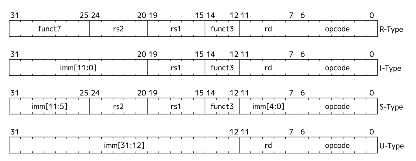

# Blog

I initially created a this file as a learning log. But somehow that's too easy, and the more I think about it the more it was just a excuse to be sloppy.
There's enough slop as is. 

Thus this have now become a article in the making. I will thoroughly write my design implementations down. 
Some of it might be worthy of a blog or similar, so people can try to make their own of this. Most importantly however, 
I believe writing is a way of thinking that amplifies mastery. Thus we are doing it here. 
No LLM's, no shortcuts, but pure chase of mastery.

## Background

TODO: Maybe som digital logic??

## Chap 0 - The ISA

TODO: maybe the registers?

ISA is short for instruction set architecture. It represents the way of talking to the silicon, which in our case
is Risc-V assembly. The functions used to do this is rather simple of nature. We can do first principle things like
adding, subtracting, copying, saving a value etc. All the things that the electrons would do, we can dictate. 
Coming from normal programming or just language in general the key idea for understanding this is the abstraction.
In our day-day abstraction layer a bicycle is for transport. Breaking a bicycle down, we might end up with two wheels, 
a chain, two pedals and a chasis. These are also concepts. Splitting the chassis we probably - depending on your bicycle -
som aluminum and some paint. Also valid concepts. Here programming is the chasis, and assembly is the paint.

It's probably best explained through seeing it:

Set we have a sensor out to count number of bicycles coming through a street. This seems like a rather easy concept
to express in words, and you likely have an easy time getting the picture imagined as you are reading this. 
It might be rather tedious to this by hand, hence we want a program that can do this for us.
Picking our abstraction apart we might be able to deduce it by logic. 

If we are able to obtain a sensor signal, lets call it xhigh when a bike has passed. And we then know the default
value xlow for the sensor it might become even more obvious 

 [ref: https://docs.riscv.org/reference/isa/_attachments/riscv-unprivileged.pdf]

## Chap 1 - The ALU
now implemented TODO: Write thsi